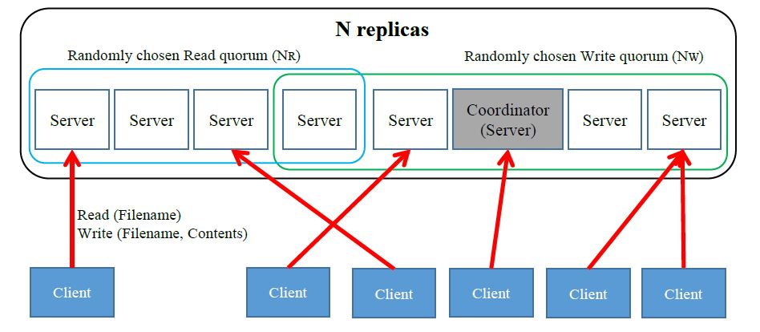

# SimpleDFS
###### Simple Distributed FIle System using the Gifford Quorum Consensus Protocol

## BRIEF

This is a simple implementation of a Distributed File System using [Gifford Quorum Voting](https://en.wikipedia.org/wiki/Quorum_(distributed_computing))
as a way to achieve replica consensus written using Thrift RPC and Java. This is mostly a P2P system so each File Server(Node) involved has the same functionality.
This system supports multiple clients and for some simplicity, one of the nodes additionally serves as a centralized Coordinator to build Quorums for each operation and for sequentially ordering concurrent Writes to the same file.
However, writes to different files as well as all reads and list operations happen concurrently.

The Client is able to issue commands(read file, write file and list files) from a CLI and additionally,
use a "simulate read/write" feature wherein it fires said type of requests with random delays and payloads.
This is useful for load testing our system.

For more information, look at [the problem description](pa3.pdf).

The code is well documented with very verbose logging and solid exception handling.

## CONFIGURATION

This [Java Properties File](gen-java/simpledfs.cfg) stores many of the values needed to dynamically configure the
system, including:
* addresses and port numbers of each of the nodes.
* filesystem paths.
* node counts, quorum size for read/write.
* coordinator id.
* background synchronization delay.

## INSTRUCTIONS

There is a makefile provided that can be used to easily build and run the project.
*YOU NEED JAVA 1.8+ AND THRIFT 0.9+ TO RUN THIS SYSTEM*
* Check to make sure the address, ports and other options are as desired in the
[config file](gen-java/simpledfs.cfg).
* Run “make clean && make” to rebuild the source.
* Run “make cli” to run the client.
* Run “make n NUM=<num>” to run the file server nodes.
	* <num> starts at 0 and should be set based on what address and port number that node runs on.
	* it's used to index into the comma separated list of addresses and port numbers provided in [the config file](gen-java/simpledfs.cfg).

